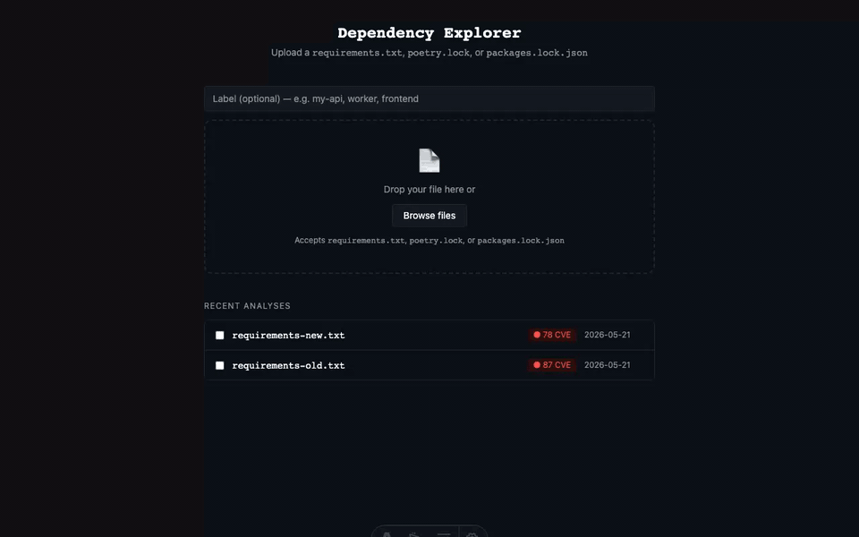
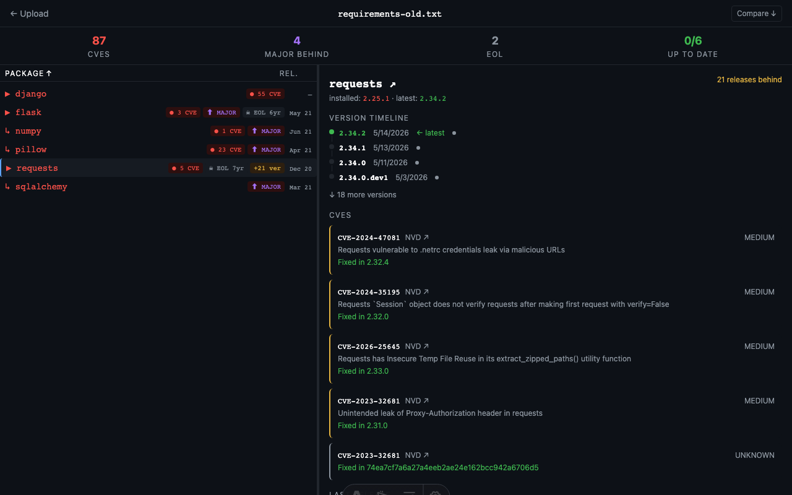
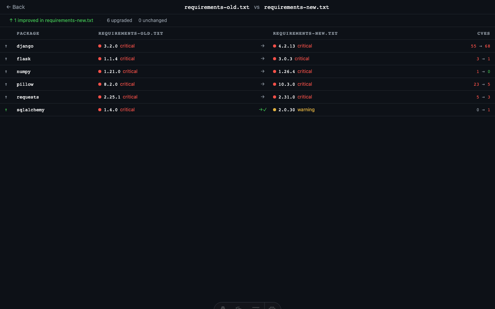

# Dependency Explorer

I kept needing a fast way to audit Python and NuGet dependency files at work — something that would show CVEs, staleness, and upgrade gaps in one place without having to cross-reference three different tools. So I built one.



## What it does

Drop in a `requirements.txt`, `poetry.lock`, or `packages.lock.json` and get back:

- **CVE scan** — checks every package against [osv.dev](https://osv.dev), flags known vulnerabilities; each CVE links directly to its osv.dev entry and NVD detail page
- **Version staleness** — shows how far behind each package is (patch / minor / major)
- **Status at a glance** — critical / EOL / warning / healthy classification per package
- **Registry links** — every package name links to its PyPI or NuGet page
- **Transitive deps** — one level of indirect dependencies surfaced per package
- **Compare mode** — diff two analyses side-by-side to see what changed between lockfiles
- **Cached results** — same file always returns instantly; no duplicate API calls





## Running it locally

Requires Node.js.

```bash
npm install
npm run dev
```

Then open `http://localhost:4321` and upload a lockfile.

For a production deploy, push to Cloudflare Pages and bind a D1 database named `DB`.

## Versioning

This project follows [Semantic Versioning](https://semver.org). Releases are tagged as `vMAJOR.MINOR.PATCH` and documented in [CHANGELOG.md](CHANGELOG.md).

| Bump | When |
|------|------|
| **Patch** | Bug fixes, no behaviour change |
| **Minor** | New features — new file formats, new columns, new UI options |
| **Major** | Breaking changes — schema migrations, removed endpoints |

## Stack

- **[Astro 6](https://astro.build)** (SSR) + **React 18** + **Tailwind 3**
- **Cloudflare Pages** for hosting, **Cloudflare D1** (SQLite) for persistence
- Analysis pipeline: PyPI + NuGet metadata APIs → [osv.dev](https://osv.dev) batch CVE lookup
- Vitest for testing, with a `better-sqlite3` shim for D1 in Node

The analysis ID is a SHA-256 of the raw file content — uploading the same lockfile twice always hits the cache. Package metadata is TTL-cached in D1 to avoid hammering upstream APIs.
